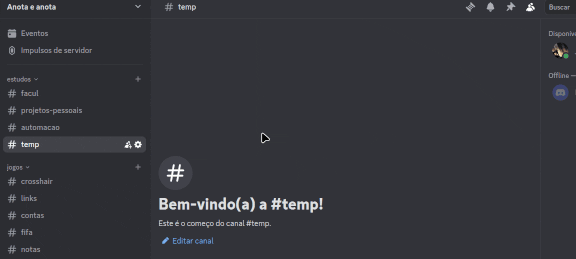

# Discord Notifier/Bot  
## Send Discord Messages to Remember Things / Birthdays

This is a simple script that allows sending reminders to a Discord channel. It can be used for a variety of purposes, such as remembering friends birthdays, important dates, or simply annoying people with a bot on Discord.  
Execution is easy: just create a new message in `msg_manager.py`, set a day and month to send it (or set the current date), and then run `sender.py`. Messages scheduled for that day will be sent, and a notification will pop up.  
To make the script work, you need to set up a virtual environment (optional but highly recommended) and add the Discord webhook URL in the `.env` file, as shown below.

---

## 📦 Installation and Configuration

First, clone the repository:

```bash
git clone git@github.com:ig-grando/discord-notifier.git
cd discord-notifier/
```

To avoid affecting system-wide Python libraries, create and activate a virtual environment:

```bash
python3 -m venv venv
source venv/bin/activate
pip install -r requirements.txt
```

> ⚠️ Remember to use `source venv/bin/activate` before running any of the scripts.

Then, copy the example environment file:

```bash
cp .env.example .env
```

Replace the example webhook URL with your actual Discord channel webhook URL in the `.env` file.  
(If you don’t have one, follow the instructions below.)



---

## ▶️ Execution

To run the program that configures the reminders file, use this command (with the virtual environment active):

```bash
python3 msg_manager.py
```

While running the manager, you can view, add, and remove reminders by following the on-screen instructions.  
To send the messages scheduled for the current day, run:

```bash
python3 sender.py
```

---

## ⏰ Recommendation

Manually running `sender.py` every day can be inconvenient. To automate it, you can use `crontab` (Linux) or Task Scheduler (Windows).  
On Linux, follow these steps:

```bash
crontab -e
```

At the end of the file, add the time schedule and your configuration. For example, to send messages automatically after booting your PC:

```bash
@reboot sleep 60 && cd /home/igor/Documents/python/discord-notifier && /home/igor/Documents/python/discord-notifier/venv/bin/python sender.py >> /home/igor/Documents/log_sender.log 2>&1
```

Just remember to update the path to match your system!

---

## 🛠️ Future Plans

- Add more detailed reminder options  
- Display messages in chronological order  
- Optimize lookup using binary search
